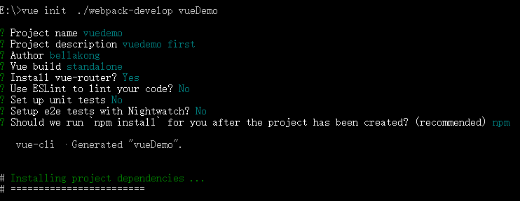

#### Vue-cli 新建项目

-----------

1. 安装[node.js](https://nodejs.org/en/)
<!-- more -->

一直next即可，安装完成会自动添加node及npm环境变量,安装完成之后查看版本号：
在cmd输入命令 node -v,回车 及 npm -v,回车

2.安装vue-cli
npm install -g vue-cli 全局安装vue-cli

3.用vue-cli创建项目

报错！查找资料，弥补方式：

- 本地下载webpack模板 https://github.com/vuejs-templates/webpack
- 将下载好的文件拷到同一个目录下（也可以拷到别的目录下，这样做是为了用本地webpack的时候容易获取到路径）
  
- 新建项目
  
3. 根据指示一步步安装 根据自己需要选择
- Project name ：项目名称
- Project description : 项目描述
- Author : 项目作者
- Install vue-router? : 是否安装引入vue-router，这里选是，vue-router是路由组件,后面构建项目会用到
- Use ESLint to lint your code? : ——强烈建议选no，eslint的格式验证非常严格，多一个空格少一个空格都会报错，会加大开发难度
- Setup unit tests 以及Setup e2e tests with Nightwatch ： 这两个是测试，可以不用安装
-  Should we run `npm install` for you after the project has been created? (recommended) npm
   vue-cli · Generated "vueDemo". : enter 自动npm-install
4. 项目安装完成
  
5. 项目目录
  
6. 运行项目
   cd 项目名字
   npm run dev
   
  