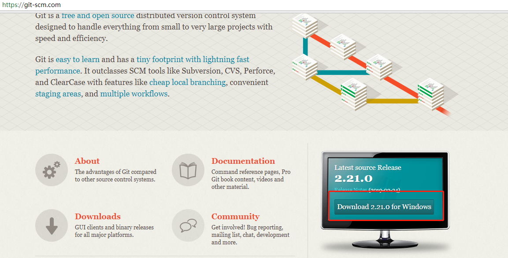
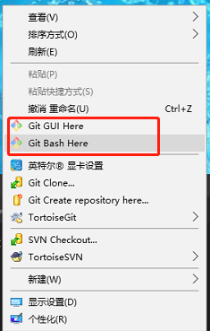
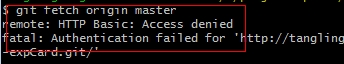
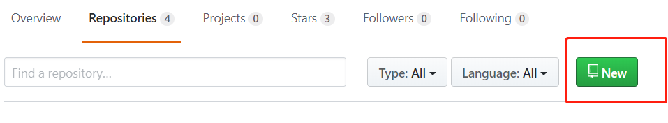
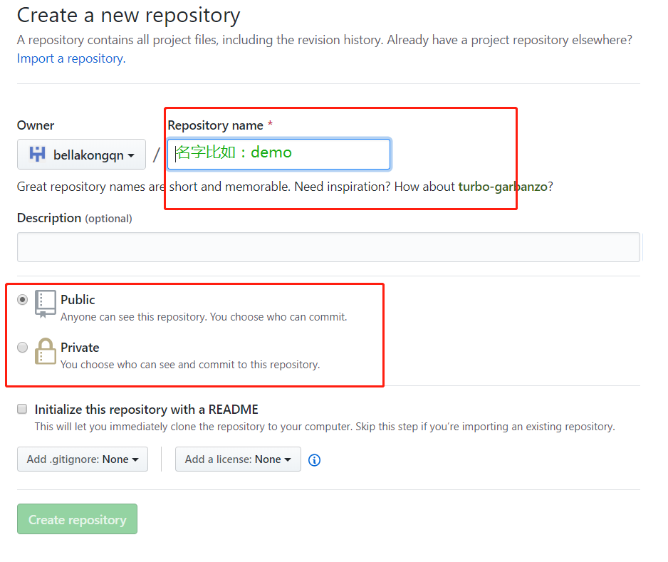

一 Git操作

1. 安装[git](https://git-scm.com/),然后按默认选项安装即可。

2.安装完成后，在开始菜单里找到“Git”->“Git Bash”，蹦出一个类似命令行窗口的东西，就说明Git安装成功！

3. 安装完成之后配置参数
- git config --global user.name "Your Name"
- git config --global user.email "email@example.com"
4. 清空参数配置
- git config --system --unset credential.helper
再进行git 操作 来重置用户名密码
或者出现这个情况
remote: HTTP Basic: Access denied
fatal: Authentication failed for 'http://********

5. 将本地项目上传git
   1. 在git上新建git仓库
   
   点击new
   
   2.
  

